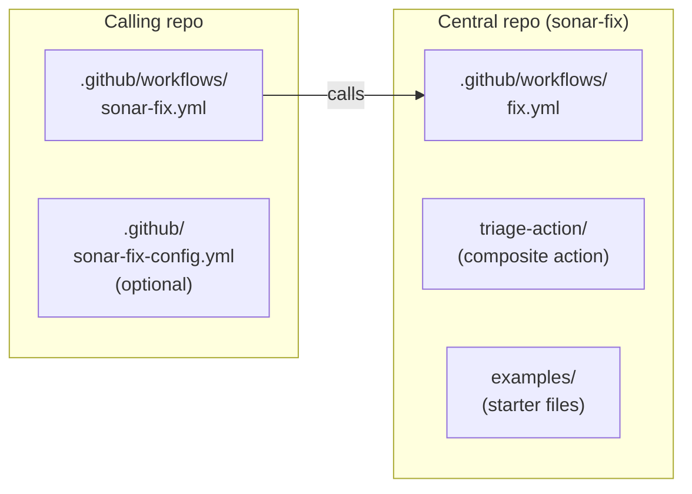

# sonar-fix

Org-wide reusable GitHub Actions workflow that fixes SonarQube issues on pull requests using AI coding agents (Claude Code, GitHub Copilot, or OpenAI Codex). A reviewer comments `/sonar-fix` on a PR, or SonarCloud's quality-gate comment fires automatically — the agent fixes the issues and pushes a commit.

## How it works

1. **Trigger** — a SonarCloud bot comment, or a `/sonar-fix` comment from a reviewer
2. **Triage** — the workflow fetches the PR's SonarQube issues and splits them into "auto-fix" (matched by your config) and "review-only" (flagged for humans)
3. **Fix** — issues in the auto-fix bucket go to a coding agent running with the SonarQube MCP server. The agent reads files, looks up rules, applies fixes, verifies via Agentic Analysis, and pushes a commit.
4. **Loop** — when the agent's fix lands, SonarCloud re-analyzes. If issues remain, the workflow runs again. A loop guard caps wasted attempts.

## Get started

`sonar-fix` works with three AI coding agents — pick one and follow its setup page top to bottom. Each page is self-contained.

| Agent | Setup page | Notes |
|---|---|---|
| **Claude Code** | [docs/claude.md](docs/claude.md) | Anthropic API key. Runs in the GitHub Actions runner. |
| **OpenAI Codex** | [docs/codex.md](docs/codex.md) | OpenAI API key. Runs in the GitHub Actions runner. |
| **GitHub Copilot** | [docs/copilot.md](docs/copilot.md) | More per-repo manual setup; coding agent runs out-of-band on GitHub's infrastructure. |

**Common prerequisites** (all three paths):

- A **GitHub organization** where you can create a central repo and grant other repos access to its workflows
- **SonarCloud** (or SonarQube Cloud / Server) already running on your PRs, with the bot posting summary comments
- A **test repo** with known SonarQube issues to pilot on

## How it gets triggered

Once installed, the workflow fires on:

- **A `/sonar-fix` comment** from a reviewer (gated by `author_association` — only `OWNER`/`MEMBER`/`COLLABORATOR` can trigger).
- **A SonarCloud bot comment** after analysis. The workflow listens for both `sonarqubecloud[bot]` (the QG summary bot) and `sonarclouddev<N>[bot]` (the reviewer-guide bot) — see [docs/gotchas.md](docs/gotchas.md#3-the-workflow-listens-for-two-sonarcloud-bots-not-one) for why both.

When the agent pushes a fix commit, SonarCloud re-analyzes, the bots post again, and the workflow fires another iteration. The loop terminates when:

- **Quality Gate passes** — the next bot trigger sees `qualityGateStatus = passed` and exits without dispatching the agent, or
- **The loop guard trips** — if more than `MAX_FIX_ATTEMPTS` (default `3`) `fix: resolve SonarQube issues` commits already exist on the PR, bot-triggered runs are skipped. A reviewer commenting `/sonar-fix` always bypasses the cap.

The workflow uses `concurrency: cancel-in-progress: true` keyed on PR number — newer Sonar state always wins over an in-flight run.

## Roll out to more repos

Once your test repo is humming through both trigger types:

1. **Copy the caller workflow** (`examples/caller-comment-triggered.yml`) to each new repo and edit `my-org`.
2. **Add `SONAR_PROJECT_KEY`** as a repo variable in each new repo.
3. **(Optional) Override the central config** per repo by creating `.github/sonar-fix-config.yml`.

The Copilot path additionally requires per-repo MCP configuration in the github.com UI on each repo — see [docs/copilot.md](docs/copilot.md).

## Documentation

- [docs/claude.md](docs/claude.md) — full setup walkthrough for Claude Code
- [docs/codex.md](docs/codex.md) — full setup walkthrough for OpenAI Codex
- [docs/copilot.md](docs/copilot.md) — full setup walkthrough for GitHub Copilot
- [docs/gateways.md](docs/gateways.md) — routing Claude or Codex through Portkey, Helicone, or an internal proxy
- [docs/configuration.md](docs/configuration.md) — `sonar-fix-config.yml` schema and the agent prompt
- [docs/architecture.md](docs/architecture.md) — `fix.yml` job structure, inputs/secrets reference
- [docs/gotchas.md](docs/gotchas.md) — non-obvious design choices, useful if you fork
- [docs/troubleshooting.md](docs/troubleshooting.md) — common misconfigurations and their fixes
