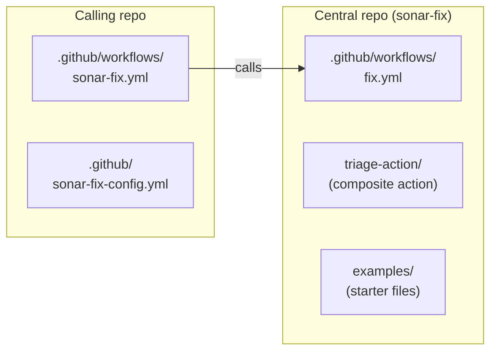
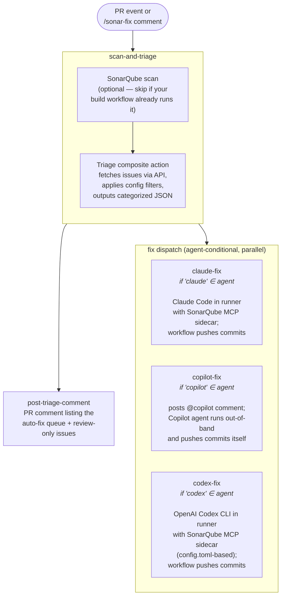

# sonar-fix

Org-wide reusable workflows that fix SonarQube issues on pull requests using AI coding agents.
Works manually on demand (a reviewer comments `/sonar-fix`) and automatically (when SonarCloud's
quality gate fails, the agent fixes the issues and pushes a commit).



## How it works

1. **Trigger** — a SonarCloud bot comment (automated) or a `/sonar-fix` comment from a reviewer (manual)
2. **Triage** — the workflow fetches the PR's SonarQube issues and splits them into "auto-fix" (matched by your config) and "review-only" (flagged for humans)
3. **Fix** — issues in the auto-fix bucket go to a coding agent (Claude Code, GitHub Copilot, or OpenAI Codex) running with the SonarQube MCP server. The agent reads files, looks up rules, applies fixes, verifies via Agentic Analysis, and pushes a commit.
4. **Loop** — when the agent's fix lands, SonarCloud re-analyzes. If the quality gate still fails, the workflow runs again. A loop guard caps wasted attempts.

---

## Prerequisites

- A **GitHub organization** where you can create a central repo and grant other repos access to its workflows
- **SonarCloud** (or SonarQube Cloud / Server) already running on your PRs, with the bot posting summary comments
- One of:
  - An **Anthropic API key** (to use Claude Code)
  - A **GitHub Copilot subscription** + a classic PAT with `repo` scope from a Copilot subscriber
  - An **OpenAI API key** (to use Codex)
- A **test repo** with known SonarQube issues you can pilot on

The setup is split into three phases. Each one is verifiable on its own — you don't run the next phase until the previous one is working.

---

## Phase 1 — Install the central repo (one-time, org-wide)

### 1.1 Create the central repo

Fork or copy this repository into your org. The recommended name is `sonar-fix`, but anything works.

Then go to **Settings → Actions → General** on the new repo and set "Access" to allow other repos in the org to use workflows and actions from this repo.

### 1.2 Add org-level secrets

**Organization Settings → Secrets and variables → Actions** → **New organization secret**:

| Secret              | Required By | Description                                |
|---------------------|-------------|--------------------------------------------|
| `SONAR_TOKEN`       | Either path | SonarQube user token. Either this **or** `COPILOT_MCP_SONAR_TOKEN` (below) must be set. The workflow uses `SONAR_TOKEN` first and falls back to `COPILOT_MCP_SONAR_TOKEN` when it's empty. |
| `COPILOT_MCP_SONAR_TOKEN` | Copilot | Same value as `SONAR_TOKEN`. Required by GitHub's Copilot platform — Copilot's MCP config can only see secrets prefixed `COPILOT_MCP_`. **If you're running Copilot, you already need this; you can skip `SONAR_TOKEN` entirely.** Claude-only setups don't need this one. |
| `ANTHROPIC_API_KEY` | Claude      | Anthropic API key. Skip if you only ever route through a virtual-key gateway like Portkey (see 1.5) — the workflow uses a placeholder. Set to your real key for direct Anthropic or for Helicone-style observability proxies that forward to Anthropic. |
| `COPILOT_PAT`       | Copilot     | GitHub PAT (classic, `repo` scope) from a Copilot subscriber |
| `OPENAI_API_KEY`    | Codex       | OpenAI API key. Required for the Codex path; usage is billed per token at OpenAI's standard API rates ([rate card](https://help.openai.com/en/articles/20001106-codex-rate-card)). When proxying through a virtual-key gateway (see 1.6), the workflow auto-substitutes a placeholder — leave this unset. For direct OpenAI or Helicone-style observability proxies, set to your real key. |
| `OPENAI_CUSTOM_HEADERS` | Codex   | Optional. Gateway auth header(s); only used when `vars.OPENAI_BASE_URL` is set. One `Header: value` per line. See 1.6. |
| `AGENT_PUSH_TOKEN`  | Claude / Codex (for loop) | GitHub PAT used to push the agent's commits. **Required for the auto-fix loop to keep iterating** on the in-runner agent paths (Claude and Codex). Pushes via PAT trigger your build/Sonar workflow on the new commit, which posts a fresh SonarCloud bot comment, which re-fires sonar-fix. Without this secret, pushes use the default `GITHUB_TOKEN` — the commit lands on the PR but downstream workflows don't auto-run (GHA's recursive-trigger protection), so the loop stalls after one fix unless someone re-comments `/sonar-fix`. Classic PAT with `repo` scope, or fine-grained PAT with `Contents: write` + `Pull requests: write`. Not used by the Copilot path (Copilot's App-identity pushes already trigger downstream workflows). |

### 1.3 Add org-level variables

Same screen → **Variables** tab → **New organization variable**:

| Variable            | Description                             |
|---------------------|-----------------------------------------|
| `SONAR_HOST_URL`    | Your Sonar host — e.g. `https://sonarcloud.io`, `https://sonarcloud.us`, or a self-hosted SonarQube Server URL. Either this or `COPILOT_MCP_SONAR_HOST_URL` (same value, different name) — the example callers fall back to the latter when this isn't set. Copilot users only need the prefixed name; it covers both the MCP config and our workflow. |
| `SONAR_ORG`         | SonarQube Cloud org key. Either this or `COPILOT_MCP_SONAR_ORG` (a Copilot path's MCP often needs both, sharing the same value). The example callers fall back to `vars.COPILOT_MCP_SONAR_ORG` when `vars.SONAR_ORG` is empty — if you're running Copilot, just set the `COPILOT_MCP_SONAR_ORG` variable and skip this one. |
| `OPENAI_BASE_URL`   | Optional. Custom OpenAI-compatible endpoint URL for routing the Codex path through Portkey, Helicone, or an internal proxy. Mirror of `ANTHROPIC_BASE_URL`. **Must be a Variable, not a Secret** — the caller workflow reads it via `vars.X`. Leave unset to call OpenAI directly. See 1.6. |
| `CODEX_MODEL`       | Optional. Codex model identifier (e.g. `gpt-5.5`). Leave unset to let Codex pick its current default. Only consulted by the codex-fix dispatch job. |

### 1.4 Install the Claude Code GitHub App (Claude path only)

The `anthropics/claude-code-action@v1` action exchanges a GitHub OIDC token for a Claude-issued app token before each run, regardless of whether you authenticate via direct API key, OAuth, or a proxy like Portkey. That exchange requires the **Claude Code GitHub App** to be installed on the repo (or the org/user account, with access granted to the relevant repos).

1. Go to **<https://github.com/apps/claude>** → **Install**
2. Choose your account (the one that owns the consuming repos)
3. Either grant access to **All repositories** (recommended for org-wide rollout) or pick the specific repos you'll install sonar-fix into
4. Confirm

The App is free and only grants the minimum access claude-code-action needs. There's no recurring cost or billing relationship — your actual Anthropic billing continues via your `ANTHROPIC_API_KEY` (or via your gateway in 1.5).

> Skip this step entirely if you'll only use the Copilot path or the Codex path — the Copilot and Codex dispatch jobs in `fix.yml` don't run claude-code-action.

> **Copilot path also needs the workflow-approval setting flipped** so the auto-fix loop can iterate without a human approving each run. Settings → Copilot → Coding agent → uncheck **"Require approval for workflow runs"**. Without this, GitHub treats every Copilot push/comment like an outside-contributor event and queues the downstream `build.yml` + `sonar-fix.yml` runs in `action_required` state — the fix lands on the PR but the loop stalls. See the [March 2026 changelog](https://github.blog/changelog/2026-03-13-optionally-skip-approval-for-copilot-coding-agent-actions-workflows/) for the trade-offs (Copilot's runs can use secrets and consume Actions minutes without manual approval — that's the whole point for an auto-fix loop, but you're trading approval-time security for autonomy).

### 1.5 (Optional) Route Claude through an API gateway

If your org accesses Claude via Portkey, Helicone, or an internal proxy instead of calling `api.anthropic.com` directly, add a variable and a secret. The workflow handles the boring bits — auth-token placeholders, when to forward your real Anthropic key — based on what's set.

> **Variable vs Secret matters here.** `ANTHROPIC_BASE_URL` must be a **Variable**, not a Secret. The caller workflow reads it via `vars.ANTHROPIC_BASE_URL`, which can't pull from secrets. URLs aren't sensitive (Portkey's, Helicone's, etc. are in their public docs), so this is the correct classification anyway. If you put the URL in Secrets by mistake, the workflow will fail at the "Validate proxy config" step with an error pointing back at this section.

**Virtual-key gateways (Portkey, etc.):** the gateway has its own keys; your real Anthropic credentials live on the gateway side.

| Name | Type | Example |
|---|---|---|
| `ANTHROPIC_BASE_URL` | variable | `https://api.portkey.ai` |
| `ANTHROPIC_CUSTOM_HEADERS` | secret | `x-portkey-api-key: pk_xxxxx` (one header per line for multiple) |

Skip `ANTHROPIC_API_KEY` from 1.2 — the workflow auto-substitutes a placeholder when proxying, and the gateway ignores it. The Claude Code GitHub App from 1.4 is still required (it gates the action's run, not the API call itself).

**Observability proxies (Helicone, etc.):** the proxy forwards your request to Anthropic; you still need your real Anthropic key in addition to the proxy's auth.

| Name | Type | Example |
|---|---|---|
| `ANTHROPIC_BASE_URL` | variable | `https://api.helicone.ai` |
| `ANTHROPIC_API_KEY` | secret (from 1.2) | your real Anthropic key (gets forwarded) |
| `ANTHROPIC_CUSTOM_HEADERS` | secret | `Helicone-Auth: Bearer hk_xxxxx` |

The reusable workflow exports `ANTHROPIC_BASE_URL`, `ANTHROPIC_AUTH_TOKEN=dummy`, and `ANTHROPIC_CUSTOM_HEADERS` to the Claude step's environment only when `ANTHROPIC_BASE_URL` is set, so direct-Anthropic users can ignore this section.

### 1.6 (Optional) Codex prerequisites and proxy routing

The Codex path runs `openai/codex-action@v1` in the runner. It uses the SonarQube MCP server identically to Claude (same Docker image, same toolset gating via `enable-agentic-analysis`). Differences from Claude:

- **Auth is API-key only.** No OIDC, no separate GitHub App. Set `OPENAI_API_KEY` per 1.2 and you're done.
- **Pricing is per-token** at OpenAI's standard API rates ([Codex rate card](https://help.openai.com/en/articles/20001106-codex-rate-card) · [Codex pricing](https://developers.openai.com/codex/pricing)). Subscription / ChatGPT plan credits don't apply in API-key CI mode.
- **Recommended model** is whatever Codex's current default is — leave `vars.CODEX_MODEL` unset unless you want to pin a specific identifier.

Like Claude, Codex can be routed through an API gateway. Set `vars.OPENAI_BASE_URL` (Variable, not Secret) to point at the gateway. The reusable workflow writes a custom `[model_providers.gateway]` entry into Codex's `config.toml` and overrides `model_provider` so Codex bypasses the built-in `openai` provider entirely.

**Virtual-key gateways (Portkey, etc.) — virtual key as bearer:**

OpenAI's auth header is `Authorization: Bearer …`, which Portkey hijacks for virtual-key resolution natively. Put your Portkey virtual key directly in `OPENAI_API_KEY` and Portkey resolves it to the real OpenAI key on its end — no custom headers needed.

| Name | Type | Example |
|---|---|---|
| `OPENAI_BASE_URL` | variable | `https://api.portkey.ai/v1` |
| `OPENAI_API_KEY` | secret | `pk_xxxxx` — your Portkey virtual key for the OpenAI route (a *different* `pk_xxxxx` than your Anthropic virtual key, since Portkey scopes virtual keys per provider) |

> This is the inverse of the Anthropic+Portkey pattern in 1.5. Anthropic's auth header is `x-api-key`, which Portkey can't intercept the same way, so the Anthropic virtual key has to ride alongside the request as `x-portkey-api-key` in `ANTHROPIC_CUSTOM_HEADERS`. OpenAI's `Authorization: Bearer` is the header Portkey resolves natively, so the Codex side is simpler — just put the virtual key in `OPENAI_API_KEY` and skip the headers secret.

**Observability proxies (Helicone, etc.) — real key + custom header:**

| Name | Type | Example |
|---|---|---|
| `OPENAI_BASE_URL` | variable | `https://oai.helicone.ai/v1` |
| `OPENAI_API_KEY` | secret (from 1.2) | your real OpenAI key (gets forwarded) |
| `OPENAI_CUSTOM_HEADERS` | secret | `Helicone-Auth: Bearer hk_xxxxx` |

**The `/v1` suffix matters.** Codex talks to `<base>/v1/responses`; without `/v1` you'll see 404s in the proxy logs.

### Verifying Phase 1

Org admins should see the new repo, the secrets, and the variables in their respective settings pages. Nothing runs yet.

---

## Phase 2 — Pilot on one repo

By the end of this phase, the test repo has **both modes live**:

- **Manual** — a reviewer comments `/sonar-fix` on a PR to trigger a fix
- **Automatic** — SonarCloud's quality gate comment fires the same workflow when QG fails, and the loop runs until QG passes (or the guard trips)

You install the caller workflow once, then validate with `/sonar-fix` first because the manual path is controllable and easy to debug. Automatic mode is already on by the time the manual run succeeds — there's no separate switch to flip.

### 2.1 Add the caller workflow to your test repo

```
your-repo/
└── .github/
    └── workflows/
        └── sonar-fix.yml          ← copy from examples/caller-comment-triggered.yml
```

In `sonar-fix.yml`, replace `my-org` with your org name.

> **Workflow permissions.** The example caller already declares the `permissions:` block (`contents: write`, `pull-requests: write`, `issues: write`) needed for the agent to push the fix commit and post review comments. You don't need to flip the repo-level "Default workflow permissions" setting — keep that as read-only for everything else and let the caller grant write per-workflow. Without this block, runs fail at validation with `Error calling workflow … is requesting 'contents: write' but is only allowed 'contents: read'`.

> **Optional override:** if you want different rules, severities, or path
> exclusions than the default, also create `.github/sonar-fix-config.yml`
> in the consumer repo (copy from `config/default.yml` in this repo as a
> starting point). Without it, the workflow falls back to the central
> default — most repos won't need to override.

> **No `AGENTS.md` to copy.** The reusable workflow injects its agent prompt
> (`prompts/sonar-fix-agent.md` in this repo) into your repo's `AGENTS.md` at
> run time, shielded from being committed back. If your repo already has an
> `AGENTS.md` with project-specific guidance, our content is appended after a
> separator for the duration of the run only — your file is unchanged outside
> sonar-fix runs. This means improvements to the agent prompt (new MCP tools,
> updated rule lookups, etc.) reach every consumer on their next run with no
> per-repo update.

### 2.2 Add the per-repo variable

In the test repo: **Settings → Secrets and variables → Actions → Variables**:

| Variable            | Description                       |
|---------------------|-----------------------------------|
| `SONAR_PROJECT_KEY` | Your SonarQube project key. Either this or `COPILOT_MCP_SONAR_PROJECT_KEY` (same value, different name) — the example callers fall back to the latter when this isn't set. If you're running Copilot you already need the prefixed name for the Copilot MCP config, so you can skip this variable. |

### 2.3 Trigger your first fix manually

1. Pick (or open) a PR on the test repo that has known SonarQube issues
2. Comment **`/sonar-fix`** on the PR

The slash command is gated by `author_association` — only `OWNER`, `MEMBER`, or `COLLABORATOR` can trigger it. This prevents drive-by commenters from running billable agent jobs on public repos.

### 2.4 What success looks like

In the **Actions** tab of the test repo you should see:

- A workflow run titled **"SonarQube Fix (Comment Triggered)"**
- **Detect Trigger & Resolve PR** — completes, output `trigger=slash-command`
- **Fix / Scan & Triage** — fetches issues from SonarQube, splits them into auto-fix and review-only
- **Fix / Post Triage Comment** — posts a PR comment listing what's queued for auto-fix and what needs human review
- **Fix / Claude Fix** — pulls the SonarQube MCP Docker image, runs the agent, pushes a commit
- A new commit on the PR with subject **`fix: resolve SonarQube issues (automated)`**

The agent's commit must use that subject prefix exactly — the loop guard (described in 2.6) counts these to enforce its attempt cap.

### 2.5 If something doesn't work

The Actions tab is the source of truth — open the failed run, click the failed job, expand the failed step. Symptoms below are listed roughly in the order you'd hit them on a fresh install. The first two are the install-time gotchas that won't show useful output via API, only in the GitHub UI.

| Symptom | Likely cause | Fix |
|---|---|---|
| **No workflow run appears at all** when SonarCloud's bot comments on the PR | Bot login mismatch. The workflow's filter expects `sonarqubecloud[bot]` by default; your Sonar product may use a different login (older `sonarcloud[bot]`, on-prem variant, etc.). | Open a recent PR comment from the Sonar bot and copy the exact author login. Set it as a repo variable `SONAR_BOT_LOGIN` (Settings → Secrets and variables → Actions → Variables) — both the job filter and the env read from it. |
| **Workflow run appears, completes in ~1 second with `startup_failure` and zero jobs.** No log archive, no useful API output. | Caller is missing the `permissions:` block. The reusable workflow needs `contents: write` etc. to push the fix commit, but the calling repo's default token is read-only. The UI shows the actual error: *"is requesting 'contents: write' but is only allowed 'contents: read'"*. | Confirm your caller (`.github/workflows/sonar-fix.yml`) has the `permissions:` block at the workflow level — the current `examples/caller-comment-triggered.yml` does. If you copied an older version, re-pull from this repo. |
| **"Run Claude Code" step fails:** *"Could not fetch an OIDC token. Did you remember to add `id-token: write` to your workflow permissions?"* | `claude-code-action@v1` authenticates via OIDC and needs `id-token: write` in addition to the contents/PR/issues writes. | Add `id-token: write` to the caller's `permissions:` block. The current `examples/caller-comment-triggered.yml` already has it; if you copied a pre-fix version, re-pull. |
| **"Run Claude Code" step fails:** *"401 Unauthorized — Claude Code is not installed on this repository. Please install the Claude Code GitHub App at <https://github.com/apps/claude>"* | The OIDC → app-token exchange requires the Claude Code GitHub App to be installed on the consuming repo (or its parent account), regardless of whether you use a direct API key or a proxy. | Install the App per Phase 1.4. Re-trigger with `/sonar-fix` — no workflow changes needed. |
| **"Run Claude Code" step fails:** *"Environment variable validation failed: Either ANTHROPIC_API_KEY or CLAUDE_CODE_OAUTH_TOKEN is required when using direct Anthropic API."* | Two possible causes: (a) the workflow couldn't detect the proxy because `ANTHROPIC_BASE_URL` was set as a Secret instead of a Variable, OR (b) you're not proxying and `ANTHROPIC_API_KEY` isn't set. | If (a), see the "Validate proxy config" step in the same run — its error explains. Move `ANTHROPIC_BASE_URL` to Variables. If (b), set the `ANTHROPIC_API_KEY` repo secret. |
| **"Validate proxy config" step fails:** *"ANTHROPIC_CUSTOM_HEADERS is set, but the anthropic-base-url input is empty"* | You set `ANTHROPIC_BASE_URL` as a repo Secret rather than a Variable. The caller reads it via `vars.X` and can't see secrets. | Delete the secret and recreate as a Variable: Settings → Secrets and variables → Actions → Variables → New. The URL value (e.g. `https://api.portkey.ai`) is non-sensitive. |
| **"Run Claude Code" step fails or hangs unexpectedly** with no useful output, when `ANTHROPIC_BASE_URL` points at a proxy | Claude Code's first-run onboarding wizard can't validate auth against a non-Anthropic endpoint and stalls in non-TTY mode. | The reusable workflow pre-creates `~/.claude.json` with `hasCompletedOnboarding: true` for proxy users — handled. If you've forked the central repo and removed that step, restore it. |
| **"Run Claude Code" step fails:** *"Workflow initiated by non-human actor: sonarqubecloud (type: Bot). Add bot to allowed_bots list or use '*' to allow all bots."* | `claude-code-action@v1` refuses bot-triggered runs by default to prevent runaway costs. The Sonar bot's QG comment is exactly that kind of trigger. | The workflow passes `allowed_bots: ${{ vars.SONAR_BOT_LOGIN || 'sonarqubecloud[bot]' }}` to the action, so the same `vars.SONAR_BOT_LOGIN` knob covers it. If you set a custom bot login, this is already wired up. |
| **`/sonar-fix` comment posted, no workflow runs** | Commenter's `author_association` isn't `OWNER`/`MEMBER`/`COLLABORATOR`. The workflow filter silently rejects to prevent drive-by commenters from running billable agent jobs on public repos. | Have someone with write access to the repo post the comment. |
| Workflow runs, "Detect Trigger" sets `should_run=false` | The PR is closed/merged, or this is a sonar-bot trigger and QG already passed. | If you intend to re-fix on a passing QG, use `/sonar-fix` — it bypasses the QG check. |
| "Scan & Triage" fails fetching issues | `SONAR_TOKEN` missing, scoped to the wrong project, or `SONAR_PROJECT_KEY` repo variable wrong. | Confirm the existing build workflow (if any) can authenticate to SonarCloud — same token. Cross-check `vars.SONAR_PROJECT_KEY` against the project key in `sonar.projectKey` in your build config. |
| "Run Claude Code" step fails with an Anthropic auth error | Using a proxy and the gateway secrets are wrong. | Re-check Phase 1.4: `ANTHROPIC_BASE_URL` (variable) and `ANTHROPIC_CUSTOM_HEADERS` (secret) must both be set, and the header value must match what your gateway expects. For direct Anthropic, `ANTHROPIC_API_KEY` must be a real key. |
| MCP container fails to start | Docker pull failed, or the runner has restricted network. | Check the "Pull MCP server image" step logs. Confirm the runner has internet access to Docker Hub (`mcp/sonarqube`). |
| Agent runs but commits nothing | `sonar-fix-config.yml` filtered everything out, or no consumer config and the central default is too restrictive for your repo's issues. | Inspect the triage step output — `has_auto_fix` should be `true`. If `false`, loosen `auto_fix.severities` or add specific rules to `auto_fix.rules.allow`. |
| **Workflow finishes `success` (`is_error: false`), agent burned 10–15 turns, but no commit appears on the PR.** | Most likely the agent didn't actually commit (everything filtered, agent decided nothing was fixable). The workflow's `Push agent commits` step always runs after the agent and pushes any local commits — so if there's no commit on the PR, the agent didn't make one. | Set `vars.SHOW_FULL_OUTPUT=true` and re-trigger. If the verbose log shows the agent ran `git commit` but the `Push agent commits` step reported "No new commits to push," something rebased history away (rare). Otherwise the agent decided not to fix; check `triage` output and the agent's reasoning. |
| **Loop iteration sequence shows runs back-to-back with one `cancelled` and the next continuing.** Visible in Actions tab as: run starts → cancels seconds later → next run picks up. | Both SonarCloud bots (QG bot and reviewer-guide bot) post within a few seconds of each other after each analysis. Both are accepted triggers and share the same concurrency group, so the second one supersedes the first. Both reflect the same analysis state, so this is correct — newer signal wins. | No action needed; this is expected. If you actually see a `cancelled` followed by a `skipped` (instead of running), see the next row. |
| **After a partial fix, no updated triage report ever appears.** Codex/Claude/Copilot fixed some issues, pushed the commit, but no second sonar-fix run posts a remaining-issues report. | Older versions of `caller-comment-triggered.yml` only listened for the QG bot's comment. SonarCloud's QG bot only EDITS its summary comment when QG status changes — a partial fix that leaves QG still failed produces no edit, so the listener never re-fires. The current caller listens for the reviewer-guide bot too (`sonarclouddev<N>[bot]`), which posts on every analysis. | Re-pull `examples/caller-comment-triggered.yml` from the central repo — it now accepts the reviewer-guide bot as a third trigger source. The `if:` filter accepts `startsWith(comment.user.login, 'sonarclouddev')` alongside the existing QG bot match. |
| **Copilot path: agent fixed and pushed, but the loop didn't re-fire.** Build workflow shows `action_required` in the Actions tab. | GitHub treats Copilot's pushes/comments like outside-contributor events; downstream workflows queue in `action_required` until a maintainer approves them. Default per-repo setting since March 2026. | Settings → Copilot → Coding agent → uncheck **"Require approval for workflow runs"**. That lets `build.yml` (and the next `sonar-fix.yml`) run automatically on Copilot's pushes. Trade-off in Phase 1.4. |
| **"Run Codex to fix issues" step fails:** *401 Unauthorized* or *invalid_api_key* | `OPENAI_API_KEY` missing, mistyped, or scoped to the wrong project. When proxying through Portkey, often means you put the Portkey virtual key in `OPENAI_CUSTOM_HEADERS` as `x-portkey-api-key:` (the Anthropic pattern) instead of putting it directly in `OPENAI_API_KEY` — Portkey resolves virtual keys from the bearer Authorization header for OpenAI routes, not from `x-portkey-api-key`. | Confirm `OPENAI_API_KEY` is a repo or org Secret (not a Variable). For Portkey, set it to your `pk_xxxxx` virtual key directly — see Phase 1.6. For Helicone, set it to your real OpenAI key. For direct OpenAI, your real key. |
| **Codex MCP step fails:** `mcp_servers.sonarqube` failed to start or hangs at startup | `mcp/sonarqube` image didn't pull (network restriction), or the MCP container's `SONARQUBE_TOKEN` env var is empty (token fallback chain in `fix.yml` returned nothing). | Check the "Pull MCP server image" step. Confirm `SONAR_TOKEN` *or* `COPILOT_MCP_SONAR_TOKEN` is set as a secret — the workflow falls back from one to the other. |
| **"Validate proxy config" step fails:** *"OPENAI_CUSTOM_HEADERS is set but openai-base-url is empty"* | You set `OPENAI_BASE_URL` as a repo Secret rather than a Variable. The caller reads it via `vars.X` and can't see secrets. | Delete the secret and recreate as a Variable: Settings → Secrets and variables → Actions → Variables → New. The URL value (e.g. `https://api.portkey.ai/v1`) is non-sensitive. |
| **Codex run completes successfully but no commit appears on the PR.** | Either Codex decided nothing was fixable, or the agent committed but the `Push agent commits` step found nothing to push (rare; usually a rebase). | Inspect the "Run Codex to fix issues" step's `final-message` output. If Codex reasoned through the issues and intentionally skipped them all, the auto-fix queue may need loosening (`auto_fix.severities` / allow-list). If it claims to have committed, check `git log` in the next step's output. |
| **Agent fix commit lands on the PR but Build, Test & Analyze never re-fires.** Loop appears stuck — second triage report (if it appears at all) shows the same issues as the first one. | `actions/checkout@v4` sets a persistent `http.https://github.com/.extraheader` config carrying an `AUTHORIZATION: basic <encoded GITHUB_TOKEN>`. That header is sent on every git request from the runner, so the push has TWO auths competing — our PAT in the URL and the GITHUB_TOKEN in the extraheader. When the GITHUB_TOKEN wins, the push is effectively `github-actions[bot]`-attributed, GHA's recursive-trigger protection drops the `pull_request: synchronize` event, and no downstream workflow runs are created. | The current `Push agent commits` step explicitly unsets the extraheader before push (`git config --local --unset-all http.https://github.com/.extraheader`). If you copied an older version of `fix.yml`, re-pull from the central repo. claude-code-action clears this header during its own auth handling, which is why the Claude path appeared unaffected for a while; codex-action doesn't, so this fix is required for the Codex path and beneficial as defense-in-depth for Claude. |
| Agent commit doesn't trigger another run | Expected on the slash-command path. The next run only fires when SonarCloud's bot edits its comment after re-analysis — see 2.6. | Wait for SonarCloud to re-scan and update its comment, or comment `/sonar-fix` again to manually re-trigger. |

### 2.6 Automatic mode (already running)

The same `sonar-fix.yml` you installed in 2.1 also listens for **two SonarCloud bots**, not just `/sonar-fix`. Once your manual run in 2.3 succeeds, the automatic loop is already live — there's nothing else to enable.

**Why two bots:** SonarCloud posts via two distinct GitHub App identities — `sonarqubecloud[bot]` for the Quality Gate summary, and `sonarclouddev<N>[bot]` for the reviewer guide. The QG bot only **edits** its summary comment when QG status changes (so a partial fix that leaves QG still-failed produces no edit, and a single-bot listener would stall after one fix iteration). The reviewer-guide bot **posts a fresh comment on every analysis**, regardless of QG state, so listening for both keeps the post-fix loop alive even when the agent only addressed a subset of issues.

**How the loop runs:**

1. SonarCloud finishes analyzing the PR. The QG bot posts (or edits) its summary; the reviewer-guide bot posts ~3s later.
2. The workflow filter matches **either** bot — the QG bot's comment containing "Quality Gate", or the reviewer-guide bot's comment containing "SonarQube". Both reflect the same analysis state.
3. **QG bot trigger** + QG passed → workflow exits, no fix run (loop terminates naturally)
4. **QG bot trigger** + QG failed → triage + agent + commit
5. **Reviewer-guide bot trigger** → triage runs; if the auto-fix bucket is non-empty the agent dispatches, otherwise an updated triage comment lands and the workflow exits cheaply (this is what produces the post-fix "remaining review-only issues" report)
6. Either path → SonarCloud re-analyzes the agent's commit (or the user's manual push) → step 1 repeats
7. Loop terminates when QG passes (no agent dispatch needed on next trigger) or the loop guard trips on too many fix commits

**Loop guard:** the workflow counts prior commits on the PR whose subject starts with `fix: resolve SonarQube issues`. If that count exceeds `MAX_FIX_ATTEMPTS` (default **3**), bot-triggered runs are skipped. A reviewer commenting `/sonar-fix` always bypasses the cap and forces another attempt.

Knobs at the top of `sonar-fix.yml`:

```yaml
env:
  SONAR_BOT_LOGIN: ${{ vars.SONAR_BOT_LOGIN || 'sonarqubecloud[bot]' }}
  MAX_FIX_ATTEMPTS: "3"                        # Loop guard
  FIX_COMMIT_PREFIX: "fix: resolve SonarQube issues"
```

> **Bot login.** The default `sonarqubecloud[bot]` matches the current SonarCloud / SonarQube Cloud bot. If your product uses a different name, set a repo variable `SONAR_BOT_LOGIN` (Settings → Secrets and variables → Actions → Variables) — both the job filter and the env reference it, so one variable change is enough. Confirm by inspecting the author of a recent SonarCloud comment on any PR.

**Concurrency:** the workflow uses `concurrency: cancel-in-progress: true` keyed on PR number. If a new comment arrives while a previous run is going, the previous run is cancelled — newer Sonar state always wins.

---

## Phase 3 — Roll out to more repos

Once one repo is humming through both manual and automatic runs:

1. **Tag a release** on the central repo: `git tag v1 && git push --tags`. Have consuming repos pin to the tag so future changes don't break them: `uses: my-org/sonar-fix/.github/workflows/fix.yml@v1`.
2. **Copy `sonar-fix.yml`** to each additional repo and edit `my-org` to match your org.
3. **Add `SONAR_PROJECT_KEY`** as a repo variable in each new repo.
4. **(Optional) Override the default config** per repo by creating `.github/sonar-fix-config.yml` — only needed when a repo wants different rules, severities, or path exclusions than the central default. Repos without this file fall back to `config/default.yml` from the central repo.

The agent prompt and default config both live centrally, so most repos only need step 2 + step 3 — one file and one variable to opt in.

---

## Reference

### Reusable workflow `fix.yml`

A single reusable workflow handles all three agent paths. The consumer's `.github/sonar-fix-config.yml` (or the central default at `config/default.yml`) chooses via the `agent:` field — a single value (`claude` / `copilot` / `codex`), a comma-separated list (e.g. `claude,codex`), or the `all` keyword — and each matching dispatch job inside `fix.yml` activates in parallel. Switching agents is a one-line edit to the config; the caller workflow doesn't change.

**Job structure inside `fix.yml`:**

1. `scan-and-triage` — runs the Sonar scanner (optional) and the triage action; outputs the issue list and the normalized comma-separated `agent` value
2. `post-triage-comment` — posts the unified triage comment (auto-fix queue + needs-review)
3. `claude-fix` — `if: contains(agent, 'claude')`. Runs Claude Code with the SonarQube MCP server, then the workflow pushes the agent's commits.
4. `copilot-fix` — `if: contains(agent, 'copilot')`. Posts an `@copilot` comment with the issues and the central agent prompt. Copilot's coding agent picks it up out-of-band and pushes commits via its own GitHub App identity.
5. `codex-fix` — `if: contains(agent, 'codex')`. Runs the OpenAI Codex CLI in the runner via `openai/codex-action@v1`, with the SonarQube MCP server configured via `$CODEX_HOME/config.toml`. The workflow pushes the agent's commits, identical to the Claude path.

**Inputs:**

| Input               | Required | Default                          | Used by | Description |
|---------------------|----------|----------------------------------|---------|-------------|
| `sonar-project-key` | Yes      | —                                | all     | SonarQube project key |
| `sonar-org`         | No       | `""`                             | all     | SonarQube Cloud org key |
| `sonar-host-url`    | No       | `https://sonarcloud.io`          | all     | SonarQube host URL |
| `config-path`       | No       | `.github/sonar-fix-config.yml`   | all     | Path to fix config |
| `run-sonar-scan`    | No       | `true`                           | all     | Set `false` if scan runs elsewhere |
| `pr-number`         | Yes      | —                                | all     | PR number (caller resolves) |
| `pr-branch`         | Yes      | —                                | all     | PR head branch (caller resolves) |
| `claude-model`      | No       | `claude-sonnet-4-6`              | Claude  | Claude model to use |
| `codex-model`       | No       | `""`                             | Codex   | Codex model identifier. Empty = let Codex pick its current default. |
| `enable-agentic-analysis` | No | `false`                          | Claude / Codex | Enables `run_advanced_code_analysis` and the cag toolset on the SonarQube MCP server. Requires SonarQube Cloud Team or Enterprise. |
| `anthropic-base-url`| No       | `""`                             | Claude  | Custom Anthropic-compatible endpoint URL. Empty = call Anthropic directly. See 1.5. |
| `openai-base-url`   | No       | `""`                             | Codex   | Custom OpenAI-compatible endpoint URL. Empty = call OpenAI directly. See 1.6. |
| `show-full-output`  | No       | `false`                          | Claude  | Surface the agent's tool calls in the run log; debug only. |

Inputs flagged for a single agent are silently ignored by the others, so callers can pass them unconditionally and switching agents stays a config-only edit.

**Secrets:**

| Secret              | Used by | Description |
|---------------------|---------|-------------|
| `SONAR_TOKEN`       | all     | Required. SonarQube user token. |
| `ANTHROPIC_API_KEY` | Claude  | Optional. Required for direct Anthropic or Helicone-style observability proxies. Skip for Portkey-style virtual-key gateways. |
| `ANTHROPIC_CUSTOM_HEADERS` | Claude | Optional. Gateway auth header(s); only when `anthropic-base-url` is set. |
| `OPENAI_API_KEY`    | Codex   | Required. OpenAI API key. Skip for Portkey-style virtual-key gateways (workflow substitutes a placeholder). Set for direct OpenAI or Helicone-style proxies that forward to OpenAI. |
| `OPENAI_CUSTOM_HEADERS` | Codex | Optional. Gateway auth header(s); only when `openai-base-url` is set. Wired into the `[model_providers.gateway.http_headers]` block of the Codex config. |
| `AGENT_PUSH_TOKEN`  | Claude / Codex | Optional but recommended. PAT for the workflow's push step — required for the auto-fix loop to keep iterating on the in-runner agent paths (see 1.2). Not used by the Copilot path; Copilot pushes via its own App identity. |
| `COPILOT_PAT`       | Copilot | Required. PAT used to post the `@copilot` comment. |

**Additional Copilot setup:** Each consuming repo must have the SonarQube MCP server configured in Copilot's settings on github.com (Settings → Code & automation → Copilot → Coding agent → MCP configuration) and `COPILOT_MCP_SONAR_TOKEN` / `COPILOT_MCP_SONAR_ORG` set as Copilot environment secrets. See `examples/copilot-mcp-setup.json`. There's no API or file-based mechanism for this — it's a one-time UI step per repo, mandated by GitHub's Copilot platform.

### Why the caller declares the same permissions as the reusable workflow

GitHub Actions reusable workflows don't automatically inherit a permissions grant from their declarations — the calling workflow's `permissions:` block sets the **cap**, and the reusable workflow's block sets what it requests within that cap. If the caller is more restrictive (or doesn't declare a block at all and the repo defaults to read-only), the call fails at validation time with errors like:

> Error calling workflow … is requesting `contents: write, id-token: write, …` but is only allowed `contents: read, …`

So the example callers explicitly grant:

```yaml
permissions:
  contents: write       # push the agent's fix commit
  pull-requests: write  # post review comments on the PR
  issues: write         # PR comments are issue comments under the hood
  id-token: write       # claude-code-action requests an OIDC token
```

Each one matches a permission the underlying reusable workflow asks for. The duplication is annoying, but listing it on the caller is the only way to keep "Default workflow permissions" set to read-only repo-wide while still letting sonar-fix do its job. It also keeps the auth surface visible in the consumer's own repo — anyone reviewing `.github/workflows/sonar-fix.yml` can see exactly what the workflow can do without chasing into the central repo.

The unified `fix.yml` requests all four permissions even when only one agent is active. Granting unused permissions is harmless — they only authorize jobs that don't run for the current agent. This keeps the caller's permissions block agent-agnostic, so switching `agent:` in your config is a one-line edit. Note: the Codex path doesn't actually need `id-token: write` (no OIDC flow), but leaving it in the caller's block is fine because the permission is only consumed by claude-code-action when that job runs.

### `sonar-fix-config.yml`

Per-repo config controlling which issues get auto-fixed vs. flagged for human review. The triage script (`triage-action/triage_sonar_issues.py`) applies a priority chain:

```
deny list → allow list → path exclusions → severity/type match
```

Issues matching ALL filters land in `auto_fix`; everything else is `review_only`.

| Section | What it controls |
|---|---|
| `agent` | Single value (`claude` / `copilot` / `codex`), comma-separated list (`claude,codex`), or the keyword `all` (= every agent). |
| `auto_fix.severities` | Which Sonar severities to fix (e.g. `BLOCKER`, `CRITICAL`, `MAJOR`) |
| `auto_fix.types` | Which issue types (`BUG`, `CODE_SMELL`, `VULNERABILITY`) |
| `auto_fix.rules.allow` | Rule keys ALWAYS fixed (overrides severity/type filter) |
| `auto_fix.rules.deny` | Rule keys NEVER fixed — sent to review-only (overrides everything) |
| `paths.exclude` | File globs to skip entirely (test fixtures, generated code) |
| `guardrails.max_issues_per_run` | Hard cap on issues sent to the agent — controls cost |
| `guardrails.max_turns` | Agent iteration cap |

The central default lives at `config/default.yml` in this repo and is annotated. Copy it to `.github/sonar-fix-config.yml` in your consumer repo only when you need to override; the workflow uses the consumer file when present and falls back to the default otherwise.

### Agent prompt (`prompts/sonar-fix-agent.md`)

The central agent prompt lives in this repo at `prompts/sonar-fix-agent.md` and defines the SonarQube **Guide → Fix → Verify** protocol every agent must follow:

- **Guide** — gather context via `get_guidelines`, `search_by_signature_patterns`, `get_current_architecture`, etc. before editing
- **Fix** — for each issue, call `show_rule` to read the rationale, then apply a minimal targeted change
- **Verify** — after every file modification, call `run_advanced_code_analysis` to catch regressions; max 3 fix-verify cycles per file
- **Commit** — subject must start with `fix: resolve SonarQube issues` (the loop guard depends on this prefix)

How it gets to the agent:

- **Claude path** — the workflow appends this file to the consumer's `AGENTS.md` at run time (shielded from being committed back via `git update-index --skip-worktree`, or `.git/info/exclude` if no `AGENTS.md` existed). Claude Code reads `AGENTS.md` from the working tree as it normally would.
- **Codex path** — same `AGENTS.md` injection step. Codex CLI walks up the working tree looking for `AGENTS.md` and follows the same convention as Claude, so the central prompt requires no agent-specific branching.
- **Copilot path** — the workflow inlines the file's contents into the `@copilot` PR comment body alongside the issue list.

Either way, this is the single source of truth. If the SonarQube MCP server gains a new tool, edit this one file and every consumer picks it up on their next run — no per-repo change required.

### When SonarQube already scans on PRs

Most teams already have a CI step that runs the Sonar scanner. Set `run-sonar-scan: false` in the caller workflow — the triage job will skip the scan step and fetch existing issues straight from the SonarQube API:

```yaml
uses: my-org/sonar-fix/.github/workflows/fix.yml@v1
with:
  sonar-project-key: ${{ vars.SONAR_PROJECT_KEY }}
  run-sonar-scan: false
secrets: inherit
```

The `examples/caller-comment-triggered.yml` already sets this — the comment trigger fires *after* SonarCloud's analysis completes, so re-running the scan would be redundant.

### Versioning

Tag releases on the central repo (`v1`, `v1.1`, etc.). Consuming repos pin to a tag:

```yaml
uses: my-org/sonar-fix/.github/workflows/fix.yml@v1
```

Use `@main` during development, pin to tags for production rollouts.

### Architecture (under the hood)


