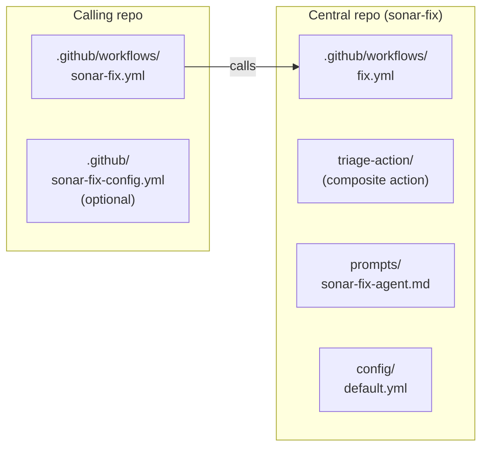
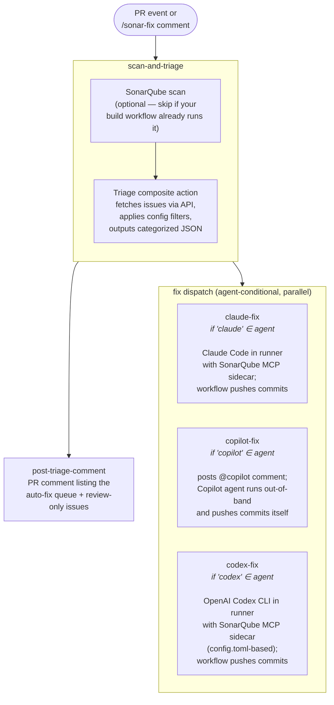

# Architecture

This page documents how `sonar-fix` is structured internally — the layers, the jobs inside the reusable workflow, and the inputs/secrets reference. Useful if you're forking, debugging, or contributing.

If you're just installing `sonar-fix`, you don't need any of this. Start at one of the agent setup pages: [claude.md](claude.md), [codex.md](codex.md), or [copilot.md](copilot.md).

---

## Three layers



1. **Caller workflows** (live in each consuming repo) — handle the trigger event (PR comment from SonarCloud, slash command, or PR open/push), resolve PR context, and call the reusable workflow. The example callers in `examples/` are self-contained and require minimal editing.
2. **Reusable workflow `fix.yml`** (in this central repo at `.github/workflows/`) — trigger-agnostic orchestration. Receives `pr-number` and `pr-branch` as explicit inputs so it works with any trigger type.
3. **Composite triage action `triage-action/`** — Python script + `action.yml` that fetches SonarQube issues, categorizes them against the repo's fix config, and outputs structured JSON.

---

## Inside `fix.yml`

The reusable workflow has five jobs:



| Job | Always runs? | Description |
|---|---|---|
| `scan-and-triage` | Yes | Optionally runs the SonarQube scanner (skipped via `run-sonar-scan: false`), then runs the triage composite action. Outputs the categorized issue list and the normalized `agent` value. |
| `post-triage-comment` | Yes | Posts the unified triage comment on the PR — auto-fix queue plus review-only items. Runs even when the auto-fix bucket is empty (the comment shows what was found). |
| `claude-fix` | If `'claude' ∈ agent` | Runs Claude Code in the runner with the SonarQube MCP server attached as a Docker sidecar. The workflow's "Push agent commits" step pushes the agent's commits. |
| `copilot-fix` | If `'copilot' ∈ agent` | Posts an `@copilot` comment with the issue list and the inlined central agent prompt. Copilot's coding agent picks it up out-of-band and pushes commits via its own GitHub App identity. |
| `codex-fix` | If `'codex' ∈ agent` | Runs the OpenAI Codex CLI in the runner via `openai/codex-action@v1`, with the SonarQube MCP server configured via `$CODEX_HOME/config.toml`. The workflow pushes the agent's commits, identical to the Claude path. |

Each fix-dispatch job is gated by `if: contains(agent, '<name>')`, which is safe because no agent name is a substring of another. Multiple dispatch jobs can run in parallel — they all see the same auto-fix issue list from `scan-and-triage`.

---

## Inputs

| Input               | Required | Default                          | Used by | Description |
|---------------------|----------|----------------------------------|---------|-------------|
| `sonar-project-key` | Yes      | —                                | all     | SonarQube project key |
| `sonar-org`         | No       | `""`                             | all     | SonarQube Cloud org key |
| `sonar-host-url`    | No       | `https://sonarcloud.io`          | all     | SonarQube host URL |
| `config-path`       | No       | `.github/sonar-fix-config.yml`   | all     | Path to fix config in the consumer repo |
| `run-sonar-scan`    | No       | `true`                           | all     | Set `false` if scan runs elsewhere |
| `pr-number`         | Yes      | —                                | all     | PR number (caller resolves from event) |
| `pr-branch`         | Yes      | —                                | all     | PR head branch (caller resolves from event) |
| `claude-model`      | No       | `claude-sonnet-4-6`              | Claude  | Claude model identifier |
| `codex-model`       | No       | `""`                             | Codex   | Codex model identifier. Empty = let Codex pick its current default. |
| `enable-agentic-analysis` | No | `false`                          | Claude / Codex | Enables `run_advanced_code_analysis` and the `cag` toolset on the SonarQube MCP server. Requires SonarQube Cloud Team or Enterprise. |
| `anthropic-base-url`| No       | `""`                             | Claude  | Custom Anthropic-compatible endpoint URL. Empty = call Anthropic directly. See [gateways.md](gateways.md). |
| `openai-base-url`   | No       | `""`                             | Codex   | Custom OpenAI-compatible endpoint URL. Empty = call OpenAI directly. See [gateways.md](gateways.md). |
| `show-full-output`  | No       | `false`                          | Claude  | Surface the agent's tool calls in the run log; debug only. |

Inputs flagged for a single agent are silently ignored by the others, so callers can pass them unconditionally and switching agents stays a config-only edit.

---

## Secrets

| Secret              | Used by | Description |
|---------------------|---------|-------------|
| `SONAR_TOKEN`       | all     | Required. SonarQube user token. Falls back to `COPILOT_MCP_SONAR_TOKEN` when unset. |
| `ANTHROPIC_API_KEY` | Claude  | Optional. Required for direct Anthropic or Helicone-style observability proxies. Skip for Portkey-style virtual-key gateways. |
| `ANTHROPIC_CUSTOM_HEADERS` | Claude | Optional. Gateway auth header(s); only when `anthropic-base-url` is set. |
| `OPENAI_API_KEY`    | Codex   | Required. OpenAI API key. Skip for Portkey-style virtual-key gateways (workflow substitutes a placeholder). Set for direct OpenAI or Helicone-style proxies. |
| `OPENAI_CUSTOM_HEADERS` | Codex | Optional. Gateway auth header(s); only when `openai-base-url` is set. Wired into the `[model_providers.gateway.http_headers]` block of the Codex `config.toml`. |
| `AGENT_PUSH_TOKEN`  | Claude / Codex | Optional but recommended. PAT for the workflow's push step — required for the auto-fix loop to keep iterating. Not used by the Copilot path; Copilot pushes via its own App identity. See [gotchas.md](gotchas.md#5-agent_push_token-exists-because-of-githubs-recursive-trigger-protection). |
| `COPILOT_PAT`       | Copilot | Required. PAT used to post the `@copilot` comment. |

---

## The triage composite action

`triage-action/` is a composite GitHub action with a Python script (`triage_sonar_issues.py`) and an `action.yml` wrapper. It:

1. Reads the consumer's `.github/sonar-fix-config.yml` if present, else falls back to `config/default.yml` from the central repo.
2. Fetches PR issues from the SonarQube API using `SONAR_TOKEN`.
3. Applies the filter priority chain — **deny list → allow list → path exclusions → severity/type match**. Issues passing all filters land in `auto_fix`; everything else lands in `review_only`.
4. Normalizes the `agent` field — `all` expands to `claude,copilot,codex`, unknown tokens hard-fail with a clear error, comma lists round-trip cleanly with deterministic first-occurrence ordering.
5. Caps the auto-fix bucket at `guardrails.max_issues_per_run`; overflow goes to `review_only`.
6. Writes the categorized JSON to `$GITHUB_OUTPUT` for downstream jobs.

The script is pure Python with no external dependencies beyond `PyYAML`, so it runs without a virtualenv setup step.

---

## The SonarQube MCP server

The Claude and Codex paths attach the SonarQube MCP server (`mcp/sonarqube` Docker image) as a sidecar inside the GitHub Actions runner. Configuration:

- **Toolsets** — when `enable-agentic-analysis: true`, the workflow sets `SONARQUBE_TOOLSETS=cag,projects,analysis,issues,quality-gates,rules` and `SONARQUBE_ADVANCED_ANALYSIS_ENABLED=true`. The agent prompt then uses the Guide → Fix → Verify loop calling `get_guidelines` before coding and `run_advanced_code_analysis` after.
- **Workspace mount** — the runner's working directory is volume-mounted at `/app/mcp-workspace:rw` so the MCP server can read the agent's modified files for analysis.
- **Per-agent attachment** — Claude Code receives the MCP config via `--mcp-config /tmp/sonar-mcp-config.json`. Codex CLI has no such flag — it reads MCP servers from `$CODEX_HOME/config.toml`, so the codex-fix job pre-creates a tmpdir, writes a `[mcp_servers.sonarqube]` table into it (TOML, not JSON), and passes that dir to `openai/codex-action` via the `codex-home:` input.

The Copilot path doesn't run the MCP server in the runner. Copilot's coding agent runs out-of-band on GitHub's infrastructure, and the MCP server attaches there via per-repo UI configuration. See [copilot.md](copilot.md#5a-configure-the-sonarqube-mcp-server).

---

## Versioning

Tag releases on the central repo (`v1`, `v1.1`, etc.). Consuming repos pin to a tag:

```yaml
uses: my-org/sonar-fix/.github/workflows/fix.yml@v1
```

Use `@main` during development, pin to tags for production rollouts.
